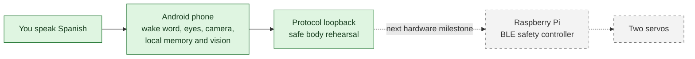

# Kiko

Kiko is a local-first Android toy that listens and responds in Spanish. The
phone is Kiko's current face, ears, camera, and private notebook. The long-term
body is a Raspberry Pi with two servos, but that hardware is not connected yet.

Kiko is a personal, noncommercial project. It does not use cloud inference or
analytics.

> New to the project? Start with the [plain-language owner guide](docs/USER_GUIDE.md).
> It explains setup, privacy, memory, vision, the body rehearsal, and common
> problems without assuming a technical background.

## Where Kiko is today



The solid boxes work now. The dashed hardware path is planned.

### Available now

- Say **“Kiko”** to open the native googly eyes and show **escuchando!**.
- Rehearse **“da N pasos,” “baila,” “para,”** and **“detente”** through the real
  versioned body-message format, entirely inside the phone. The app clearly labels
  this as a simulation and never claims physical movement.
- Ask **“Kiko, ¿qué ves?”** to show the rear-camera preview, capture one photo,
  run verified YOLO26n object detection locally, and optionally compare one face
  with explicitly enrolled local SFace identities.
- Save and answer bounded facts about named people, cats, and dogs in separate
  encrypted, inspectable, erasable registries.
- Inspect or delete retained **Historial visual** photos and their results.
- Opt into constrained **Sueño** maintenance while the phone is charging, idle,
  healthy, and thermally safe.
- Download, verify, inspect, cancel, and delete six pinned model artifacts.

### Not available yet

- Android Bluetooth LE connection to the Raspberry Pi;
- BlueZ advertising, GPIO output, servo calibration, or physical motion;
- language-model or vision-language-model inference;
- general conversation, general knowledge answers, or arbitrary memories; and
- standalone spoken face-recognition or face-enrollment commands.

The current speech recognizer and text-to-speech engine come from Android. Kiko
requests on-device Spanish recognition and speaks only with an installed Spanish
voice that Android marks as not requiring the network. These platform components
will eventually be replaced with app-owned local components.

## Try the current app

You need Android Studio, Android SDK 37, JDK 17 or newer, and a physical Android
12+ phone with an on-device Spanish recognition service.

1. Open this repository in Android Studio and run the `app` configuration.
2. Grant microphone permission.
3. Open **Modelos locales** and download **YOLO26n**. Also download **SFace** if
   you want face matching.
4. Try one of these supported examples:

| Say this | Expected result |
| --- | --- |
| “Kiko” | Eyes open and **escuchando!** appears |
| “Kiko, da tres pasos” | A three-step protocol simulation completes; nothing moves |
| “Kiko, baila” | The fixed `seal_wiggle` routine is simulated |
| “para” or “detente” | The active simulation stops without another wake word |
| “Kiko, ¿qué ves?” | Rear-camera preview, one local capture, and a short Spanish result |
| “Kiko, la comida favorita de Pedro es la pasta” | The explicit fact is encrypted and saved |
| “Kiko, ¿qué sabes de Pedro?” | Only Pedro's stored fields are returned |
| “Kiko, Luna es la gata de Pedro” | A cat record is encrypted and saved separately |

Commands may follow “Kiko” in the same utterance or within the ten-second command
window. Kiko always displays its result even when the phone has no offline Spanish
voice.

See the [owner guide](docs/USER_GUIDE.md) for face enrollment, visual history,
pet facts, Sueño, privacy, and troubleshooting. The exact bounded grammar lives
in the [Spanish command contract](docs/COMMANDS.md).

## Privacy and safety, briefly

Kiko's working rule is: **the phone may ask for an outcome; native code owns the
safety boundary**.

- Object and face inference run locally through ONNX Runtime.
- Person facts, pet facts, face identities, and photo associations use separate
  AES-GCM registries protected by Android Keystore.
- **¿Qué ves?** retains every completed photo and exact result in private visual
  history until the owner deletes it, uninstalls the app, or separately opts into
  the narrow unrecognized-photo cleanup policy.
- Face matching is a friendly toy label, never authentication.
- Kiko uses internet access only for model downloads the owner starts. It does
  not upload prompts, microphone audio, photos, labels, or inference data.
- The phone sends only semantic body commands such as “three steps.” It never
  sends model-generated servo angles or PWM values.
- The future Raspberry Pi owns calibration, bounded trajectories, its watchdog,
  connection-loss handling, and the final physical stop.

The body loopback already negotiates capabilities, validates strict UTF-8 JSON
messages, assigns command IDs and deadlines, sends heartbeats, and rejects invalid
telemetry. It is like rehearsing both ends of a telephone call on one phone: the
conversation is real, but no Bluetooth radio or motor is involved.

## Build and verify

From a configured command line:

```sh
./gradlew test
./gradlew assembleDebug
```

Run the Raspberry Pi safety-core tests and simulator independently:

```sh
PYTHONPATH=body/raspberry-pi/src \
  python3 -m unittest discover -s body/raspberry-pi/tests -v

PYTHONPATH=body/raspberry-pi/src \
  python3 -m unittest discover -s integration-tests -v

PYTHONPATH=body/raspberry-pi/src \
  python3 -m kiko_body
```

The Android app currently declares microphone, camera, and internet permissions.
It does not declare Bluetooth permissions. Internet is reserved for explicit
model downloads. WorkManager contributes only the non-runtime support needed for
opted-in deferred Sueño work; unused network-state and foreground-service
contributions are removed from the merged manifest.

## Documentation map

Choose the document that matches what you are trying to do:

| Document | Audience and purpose |
| --- | --- |
| [Owner guide](docs/USER_GUIDE.md) | Plain-language setup, use, privacy, safety, and troubleshooting |
| [Product definition](docs/PRODUCT.md) | What Kiko is, what has shipped, limitations, and roadmap |
| [Spanish command contract](docs/COMMANDS.md) | Exact supported and planned spoken behaviors |
| [Runtime flows](docs/FLOWS.md) | Mermaid walkthroughs of current and future interactions |
| [Architecture](docs/ARCHITECTURE.md) | Technical components, boundaries, data flow, and tradeoffs |
| [Model catalog](docs/MODELS.md) | Exact artifacts, hashes, sources, sizes, and licenses |
| [Body protocol](protocol/body-protocol.md) | Versioned phone-to-body wire contract |
| [Raspberry Pi body](body/raspberry-pi/README.md) | Safety core and simulator status |
| [Hardware workbook](hardware/README.md) | Parts, wiring, calibration, and physical-test gates |
| [Integration tests](integration-tests/README.md) | Cross-language checks and future hardware acceptance tests |
| [Model research](docs/MODEL_RESEARCH.md) | Dated research notes, not shipped behavior |
| [Changelog](docs/CHANGELOG.md) | User-visible and architectural changes |

Developers and AI maintainers must read [AGENTS.md](AGENTS.md) before editing.
It is the repository's source of truth for local-first behavior, memory privacy,
body safety, testing, and documentation requirements.

## Model and license note

The catalog contains four download-only GGUF language models plus runnable
YOLO26n and SFace vision artifacts. Their combined expected size is
2,169,240,646 bytes. Each artifact is pinned to an immutable source revision and
expected SHA-256 hash; details are in [docs/MODELS.md](docs/MODELS.md).

Kiko is licensed under AGPL-3.0-only because its runnable YOLO26n weights are
AGPL-3.0. See [LICENSE](LICENSE) and [docs/MODELS.md](docs/MODELS.md).
Commercial or proprietary use requires a fresh review of licenses, models,
datasets, privacy, and physical-safety assumptions.
