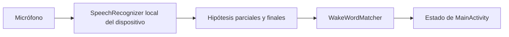
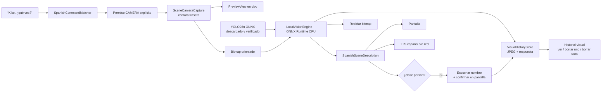
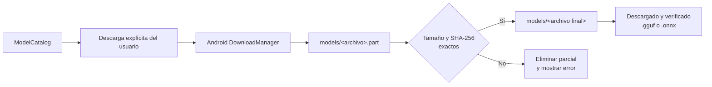
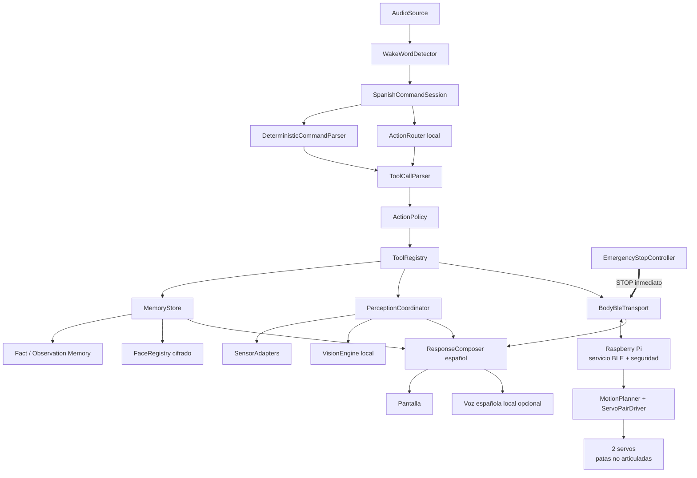
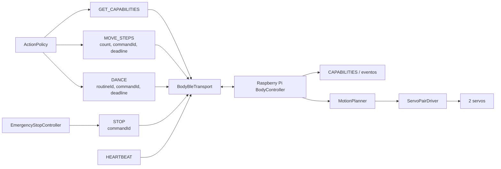

# Architecture

## Current design

The application is one Android app module with wake-word, scene-perception, and
model-management areas.

Wake-word components:

- `MainActivity` owns microphone permission, foreground lifecycle, the Android
  `SpeechRecognizer`, user-visible status, and explicit eye/preview modes.
- `KikoEyesView` draws the two native eyes without image assets or network
  dependencies. `KikoEyeMotion` maps a mode and elapsed time to deterministic
  openness and gaze values: resting, listening with blink/side-to-side motion, or
  squinting during a scene request. Continuous motion stops when Android disables
  animations.
- `WakeWordMatcher` is a platform-independent function that normalizes recognition
  hypotheses and detects the exact `kiko` token.
- `SpeechLanguageSelector` is a platform-independent function that prefers
  `es-US` and falls back to another Spanish model reported by the device.

Scene-perception components:

- `SpanishCommandMatcher` deterministically recognizes the bounded “¿qué ves?”
  grammar.
- `SceneCameraCapture` binds CameraX `Preview` and `ImageCapture` to the activity
  lifecycle, selects only the rear camera, feeds a `PreviewView` for a 1.2-second
  framing interval, returns one in-memory bitmap, and unbinds both use cases
  immediately after capture.
- `LocalVisionEngine` runs the verified YOLO26n ONNX artifact through ONNX Runtime
  1.28.0 on CPU off the UI thread, validates the expected tensor contract,
  letterboxes and normalizes the frame, emits thresholded COCO labels, saves the
  oriented capture and result, and then recycles every working bitmap.
- `Yolo26DetectionParser` maps the pinned model's contiguous COCO category indices
  and rejects malformed boxes, confidence values, classes, or tensor widths in
  platform-independent code.
- `SpanishSceneDescription` translates, counts, and limits those structured
  labels into a short Spanish sentence. It does not accept free-form model output.
- `SpanishPersonNameExtractor` accepts at most three name words from the bounded
  post-detection speech window, recognizes explicit cancellation, rejects digits
  and unexpected characters, and does not use a language model.
- `VisualHistoryStore` owns app-private JPEG and metadata records, atomic
  publication/update, newest-first listing, confirmed person-name tags, targeted
  deletion, and erase-all. Metadata v2 remains backward-compatible with unnamed
  v1 records.
- `VisualHistoryActivity` renders those records with the exact response attached
  to each capture and exposes both deletion controls.
- `OfflineSpanishSpeaker` selects an installed Spanish `Voice` only when Android
  reports that it does not require a network connection. Lower pitch and speech
  rate provide the current simple robotic effect.

Model-management components:

- `ModelCatalog` defines immutable upstream GGUF and ONNX artifacts, their
  purposes, expected sizes, SHA-256 hashes, licenses, and gating requirements.
- `ModelLibraryActivity` renders catalog state and handles explicit user actions.
- `ModelDownloadStore` delegates durable transfer to Android `DownloadManager`,
  persists download identifiers, reports progress, and finalizes verified files.
- `HuggingFaceTokenStore` encrypts the optional Gemma read token with an AES-GCM
  key held by Android Keystore.

Data flows in one direction:

The activity creates the recognizer after permission is granted and requires the
device's on-device service. The recognition path never makes a network request.
On Android 13 and newer it checks installed Spanish support before listening. If
the system supports Spanish but its model is missing, the app asks the system
speech service to download that model and waits for the user to reopen Kiko after
completion.
Recognition is started on `onStart`, stopped on `onStop`, and destroyed on
`onDestroy`.

Partial and final hypotheses are both sent to `WakeWordMatcher` and shown on screen
for diagnosis. Silence/no-match errors restart after a delay; busy errors use a
longer delay. Language, permission, and unexpected errors stop the blind retry
loop and display an actionable state.

The first perception data flow is also one-way and bounded:

The wake word opens a ten-second command window. Starting perception cancels the
speech recognizer so Kiko cannot hear its own TTS. Leaving the activity cancels
camera and voice work. Permission denial, missing rear camera, capture failure,
analysis failure, a missing/unverified vision model, or missing offline voice
produces a visible Spanish result without a cloud fallback. Model absence never
selects the old heuristic path, and a known-missing model is rejected before the
camera opens.

## Platform and security choices

- Minimum Android version: Android 12 (API 31), where
  `createOnDeviceSpeechRecognizer` is available.
- Compile/target SDK: 37.
- Permissions: `RECORD_AUDIO` for the wake word, `CAMERA` for an explicit
  “¿qué ves?” capture, and `INTERNET` for explicit model artifact downloads.
- Bluetooth permissions are intentionally absent until Android body discovery and
  control are implemented.
- The current debug APK is universal and therefore packages ONNX Runtime native
  libraries for all dependency-provided ABIs. Production distribution should use
  ABI splits or an Android App Bundle rather than narrowing supported ABIs in the
  source configuration.
- Network activity is forbidden for recognition, prompts, inference, analytics,
  and silent catalog fetching.
- Preferred recognition language: `es-US`, falling back to another installed
  Spanish language tag when the service reports one.
- Partial results: requested and inspected when the service supplies them.

On-device recognition availability is device-dependent. The app reports an
unavailable state instead of falling back to a recognizer that might send audio to
a server. This preserves the local-first invariant.

CameraX is a local camera abstraction, not a network service. Vision uses the
MIT-licensed ONNX Runtime Android API directly on CPU; it does not use ML Kit,
MediaPipe Tasks, a cloud API, or an SDK telemetry layer. The YOLO26n weights are
AGPL-3.0, so the repository is licensed AGPL-3.0-only; proprietary or commercial
deployment requires a new license review and an applicable Ultralytics Enterprise
license. Platform TTS remains a temporary dependency. Each completed explicit
“¿qué ves?” capture is written as a JPEG plus bounded metadata under Kiko's
internal app-private files directory. The image and exact result remain local,
are removed by per-item deletion, erase-all, or app uninstall, and require no
broad storage permission. Kiko does not impose an automatic retention cap in the
current troubleshooting milestone. The `person` class remains an object label,
not identity or face enrollment. When it is present, Kiko can attach a
user-supplied name to that single history record after an unlocked on-screen
confirmation. The record is protected by Android app-private storage and device
file-based encryption, and is not queried for future identity matching.

Android's `SpeechRecognizer` remains an utterance-oriented bootstrap dependency,
so microphone sessions can visibly cycle during silence. Reliable continuous
operation requires the planned app-owned streaming wake-word detector.

## Model download flow

Transfers continue under the system download manager when the model screen is not
visible. Kiko polls persisted download IDs while the screen is active. Canceling
removes the system transfer and partial file. Deleting removes the verified file.
Uninstalling Kiko removes the app-specific model directory.

Catalog URLs use immutable Hugging Face commit revisions or the numeric GitHub
release-asset ID for YOLO26n. Expected file sizes and SHA-256 hashes are recorded
in code and `docs/MODELS.md`. The GitHub API download includes an explicit
`application/octet-stream` request header. A download is never promoted from
`.part` to its final `.gguf` or `.onnx` filename unless both checks pass.

Gemma is a special authenticated path: the user accepts its license externally,
then supplies a read token. The token is encrypted at rest with Android Keystore,
is passed only as an authorization header to Android's download manager, and is
never logged. Other catalog artifacts are public and require no credential.

## Intended toy architecture

Future work should retain replaceable boundaries even if the concrete classes
change:

- `AudioSource` owns microphone frames and buffering.
- `WakeWordDetector` consumes audio locally and emits activation events.
- `SpanishCommandSession` owns the bounded interaction after the wake word and
  guarantees Spanish clarifications, status, and responses.
- `DeterministicCommandParser` has priority for emergency stop, unambiguous step
  counts, allowlisted dance requests, and explicit deletion. These commands do not
  wait for generative inference.
- `EmergencyStopController` receives the native “para”/“detente” grammar and
  on-screen stop control. It sends `STOP` without waiting for the action router,
  memory, vision, or conversational pipeline.
- `ActionRouter` owns model loading, typed tool proposals, token generation, and
  device resource limits. The leading research candidate is a Kiko-specific
  FunctionGemma 270M fine-tune, but the boundary must remain model-independent.
- `ToolCallParser` accepts only the selected model's documented format and converts
  it into a closed internal schema.
- `ActionPolicy` treats model output as untrusted, separates observation from
  mutation, clamps physical parameters, requests confirmations, and enforces
  deadlines and emergency-stop behavior.
- `ToolRegistry` exposes only tools implemented and currently available on the
  device.
- `MemoryStore` separates confirmed durable facts from ephemeral conversation
  history. It supports inspection, targeted deletion, and erase-all.
- `MemoryCandidateResolver` may select one explicit memory candidate from the
  current command session and requires a Spanish read-back confirmation before
  persistence. It never promotes conversation automatically.
- `FaceRegistry` stores names and encrypted face embeddings from explicit
  enrollments. It does not retain source photos by default and never exposes raw
  embeddings to a language model.
- `PerceptionCoordinator` turns an explicit perception request into a bounded
  sensor sample, still-camera capture, or face-recognition operation.
- `SensorAdapters` use native Android APIs and summarize timestamped sensor
  readings; raw high-rate streams do not enter the language model context.
- The current `LocalVisionEngine` letterboxes a camera frame to `640 × 640`,
  converts RGB pixels into normalized NCHW float input, and converts the pinned
  YOLO26n end-to-end output into thresholded COCO object labels. It stores the
  original-resolution oriented capture rather than the letterboxed inference
  bitmap. A future replacement may produce a richer compact structured Spanish
  observation, but must remain app-owned, local, and free of SDK telemetry.
  Identity comes from a separate future face detector and embedding matcher, not
  from the `person` object class or a vision-language model.
- The current person-name follow-up is deliberately not `FaceRegistry`
  enrollment: it stores no crop or embedding and never claims a later match. The
  whole-photo annotation follows the visual-history record's inspect/delete-one/
  erase-all lifecycle.
- `BodyBleTransport` is the future Android BLE-central boundary. It owns discovery,
  bonding, GATT connection state, MTU negotiation, protocol version negotiation,
  heartbeats, reconnects, and event indications.
- The Raspberry Pi body service is the BLE peripheral and final physical safety
  authority. Its transport-independent `BodyController` validates semantic
  commands, enforces idempotency, deadlines and a connection watchdog, and selects
  only body-owned motion plans.
- `MotionPlanner` defines bounded seal-like strides and allowlisted dances for two
  non-articulated servo legs. A future `ServoPairDriver` owns GPIO, calibrated
  pulse widths, angle clamps, neutral position, and immediate stop.

The model never owns Android permissions and never writes directly to a sensor,
camera, location, BLE API, or servo driver. No UI class should eventually contain
model inference, sensor acquisition, safety policy, or body protocol logic. The
research and benchmark gate are detailed in `docs/MODEL_RESEARCH.md`. End-to-end
Mermaid sequences for each command family are in `docs/FLOWS.md`.

## Command routing

The initial command set is deliberately narrow and versioned in
`docs/COMMANDS.md`.

- Native deterministic parsing always owns “para” and “detente”.
- Exact step and dance requests take the deterministic path when possible.
- The action model handles paraphrases and selects knowledge, perception, face,
  and memory tools.
- The conversational model answers local knowledge questions after retrieving
  relevant confirmed memories.
- The current local object detector receives a still frame only after “¿qué ves?”.
  Any future vision model must preserve that explicit gating.
- The face matcher receives a still frame only for explicit enrollment or
  “¿a quién ves?” and returns `unknown` below its configured threshold.

A local response composer converts native results and model text into Spanish
screen output and, when installed, offline Spanish speech synthesis. Kiko reports
an action as complete only after the native tool returns an acknowledgement.

## Memory and privacy

Durable memory is opt-in per command. `remember_fact` stores supplied content;
`remember_observation` stores only a confirmed textual scene description. A bare
“recuerda esto” may resolve only one unambiguous candidate from the current
command session and must read it back before saving. Ordinary conversation remains
ephemeral. The first implementation should prefer structured SQLite records and
local full-text search over introducing another embedding model.

Face recognition stores an encrypted identity record and one or more face
embeddings after explicit naming and an on-screen owner confirmation while the
phone is unlocked. Explicit “¿qué ves?” troubleshooting captures are the narrow
exception to default camera ephemerality: every completed capture is retained
locally with its result and stays inspectable and erasable. A detected-person
photo may receive one spoken name only after an unlocked on-screen confirmation;
that name labels the photo and is not a face identity record. The photo and tag
remain app-private under Android file-based encryption and are erased together.
Future face matching and enrollment source photos remain discarded by default.
Facts, future face names/embeddings, and later indexes remain local, use keys
protected by Android Keystore, and are removed through targeted forget commands,
erase-all, or app uninstall.

Face matches are presentation-only hints, never authentication. They cannot
authorize body actions, disclose private memories, or enter owner settings.
Owner-only operations such as face enrollment, identity deletion, and erase-all
must not depend on a voice or face match alone.

Noncommercial use does not weaken these privacy boundaries. It only changes which
model licenses are eligible for evaluation.

## Toy body protocol

The first physical protocol should expose semantic commands rather than raw motor
power:

`GET_CAPABILITIES` supplies limits such as `maxStepsPerCommand`, available dance
routines, protocol version, and stop support. `ActionPolicy` rejects or asks for
clarification instead of inventing absent capabilities. Dances are fixed,
body-tested macros. Android sends `HEARTBEAT` while motion is active. Missed
heartbeat, BLE disconnect, deadline expiry, invalid telemetry, application
lifecycle loss, or emergency stop terminates motion. The Pi independently enforces
its command deadline and 750 ms link watchdog so Android process failure cannot
leave a motor running. A reconnect never resumes the interrupted action.

BLE v1 uses a custom GATT service with a write-with-response command
characteristic and an indicated event characteristic. Messages are strict UTF-8
JSON envelopes no larger than 512 bytes. Android must negotiate enough ATT MTU
for a complete message because v1 does not define application-level
fragmentation. The canonical UUIDs, envelopes, schemas, fixtures, retry rules, and
bonding requirements are in `protocol/body-protocol.md`.

The monorepo contains distinct deployable boundaries:

- `app/` builds the Android APK;
- `body/raspberry-pi/` builds and tests the Pi service independently;
- `protocol/` is the shared versioned contract;
- `hardware/` records parts, power, wiring, calibration, and mechanical limits;
  and
- `integration-tests/` owns Android-to-Pi compatibility and failure cases.

The current Pi bootstrap is deliberately transport-independent and runs with a
simulated servo pair. It does not yet advertise through BlueZ or drive GPIO. No
physical angles, pins, pulse widths, or power assumptions become production
defaults until the selected hardware is documented and calibrated.

## Verification strategy

- Plain JVM unit tests cover normalization and wake-word boundaries.
- Plain JVM unit tests cover listening gaze direction, blink closure/reopening,
  and squint openness independently from Android drawing.
- Plain JVM unit tests cover the “¿qué ves?” grammar and deterministic Spanish
  response composition, plus visual-history metadata round trips and malformed
  record rejection.
- Plain JVM unit tests cover person-label gating, bounded Spanish name extraction
  and cancellation, metadata migration, and confirmed-name serialization.
- Standard-library Python unit tests cover strict body-protocol parsing, bounded
  two-servo trajectories, native capability limits, idempotent command IDs,
  deadline rejection, heartbeat watchdog, completion, and emergency stop.
- Catalog tests require five unique entries with immutable revisions or numeric
  asset IDs, known sizes, purpose-appropriate filenames, and SHA-256 hashes,
  including the reviewed YOLO26n ONNX pin.
- Android build and lint validate manifest/API integration when an SDK is present.
- A Redmi Note 10 Pro on Android 13 has produced `ki`, `kik`, and `Kiko` partial
  hypotheses plus `Kiko`/`Quico` final alternatives, confirming the current
  end-to-end wake-word path.
- A repeatable device test is still required before microphone behavior can be
  treated as regression-tested. Rear-camera preview/capture, eye rendering,
  ONNX Runtime object-detection results/performance, visual-history persistence/
  rendering/deletion, person-name listening/confirmation, and offline TTS also
  require physical-device validation; Android BLE, BlueZ, GPIO, and
  physical-servo integration remain untested.
- Download endpoint probes validate the GGUF magic bytes for all public catalog
  artifacts. Full transfer, cancellation, resumption, and checksum verification
  still require physical-device validation.
