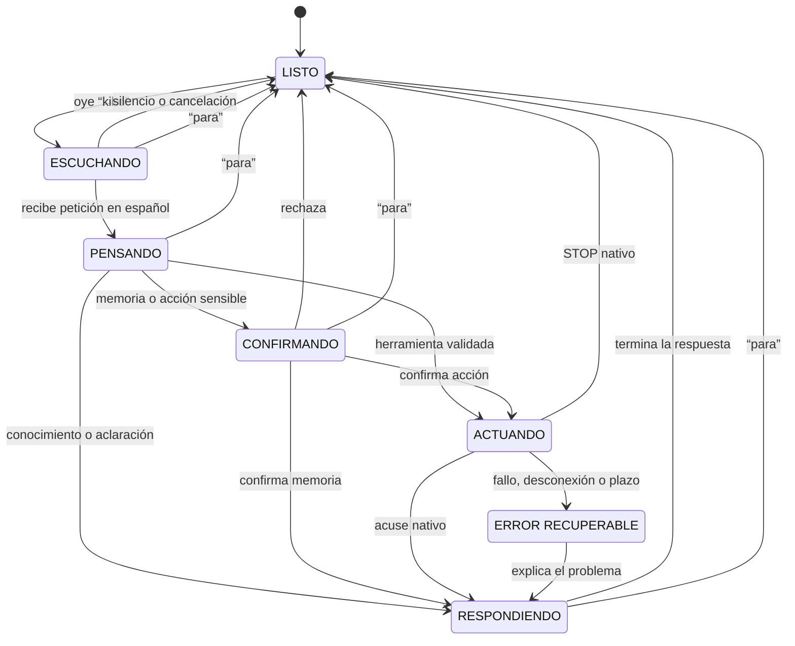
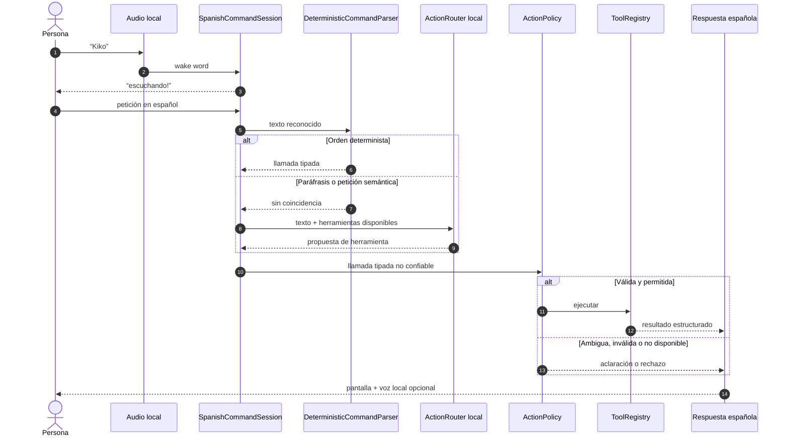
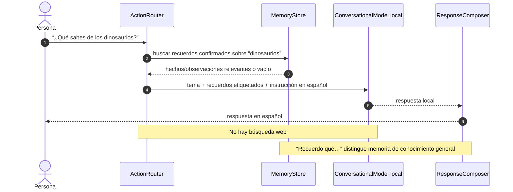
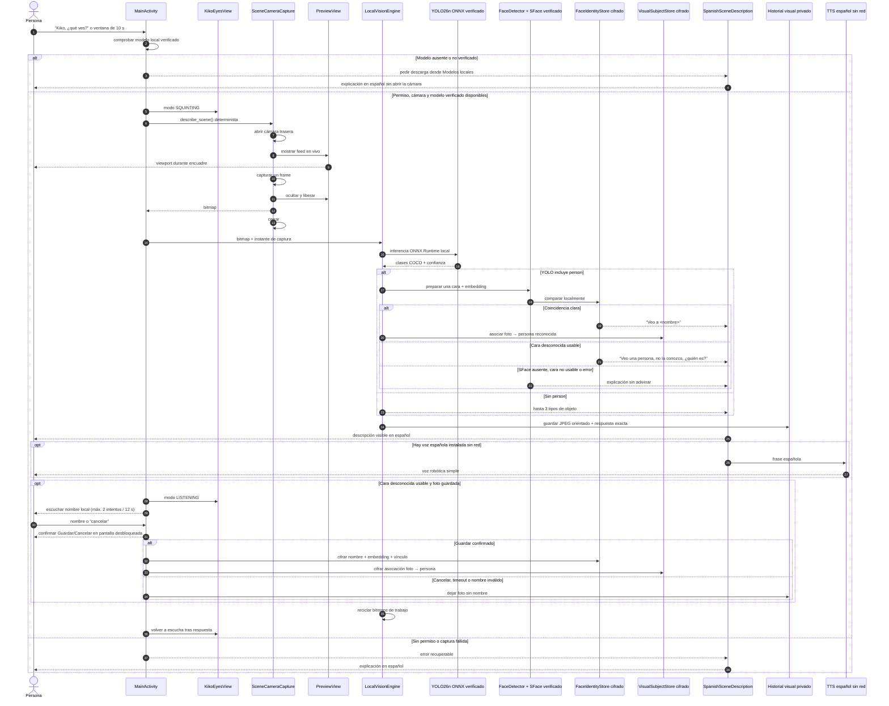
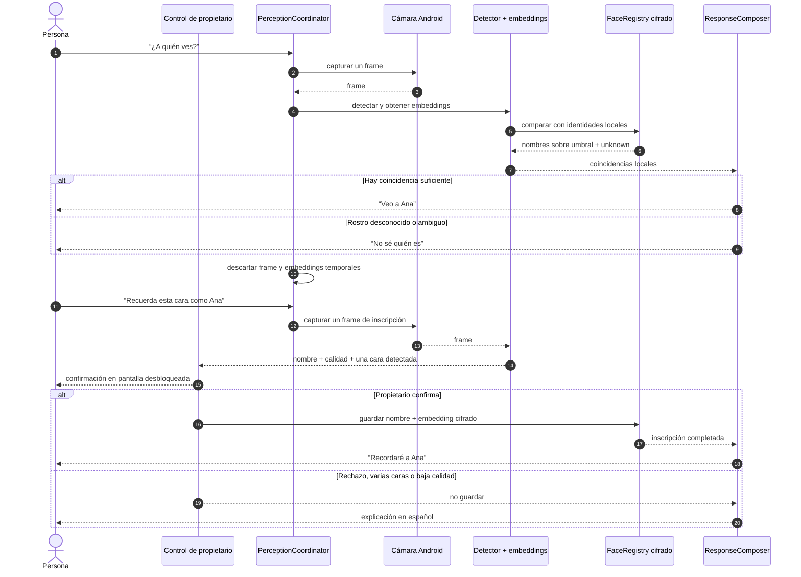
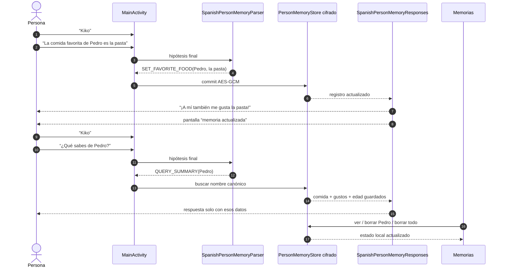
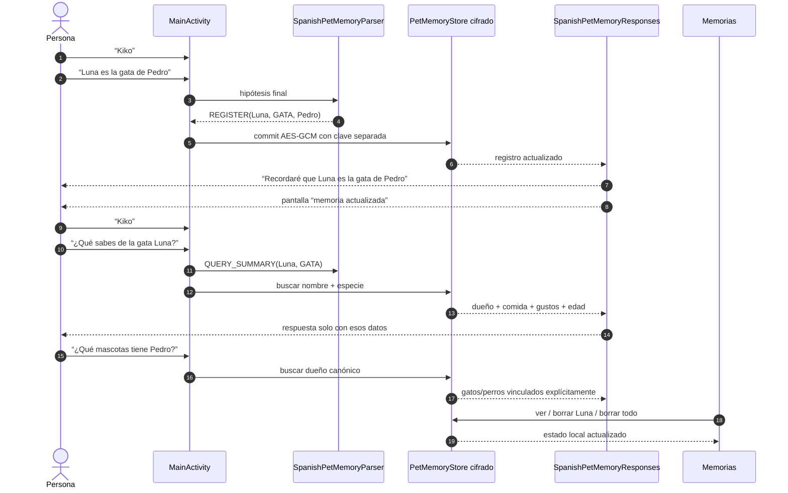
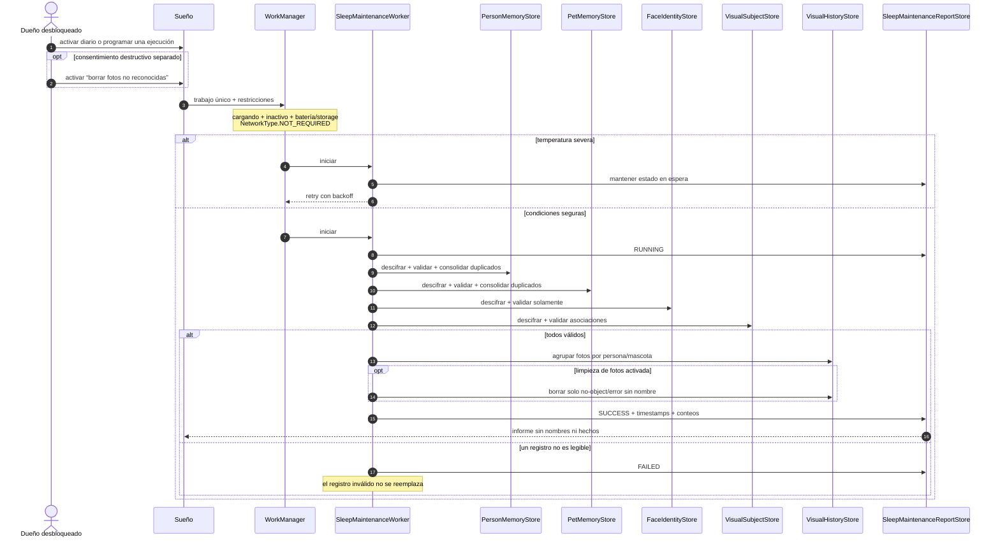
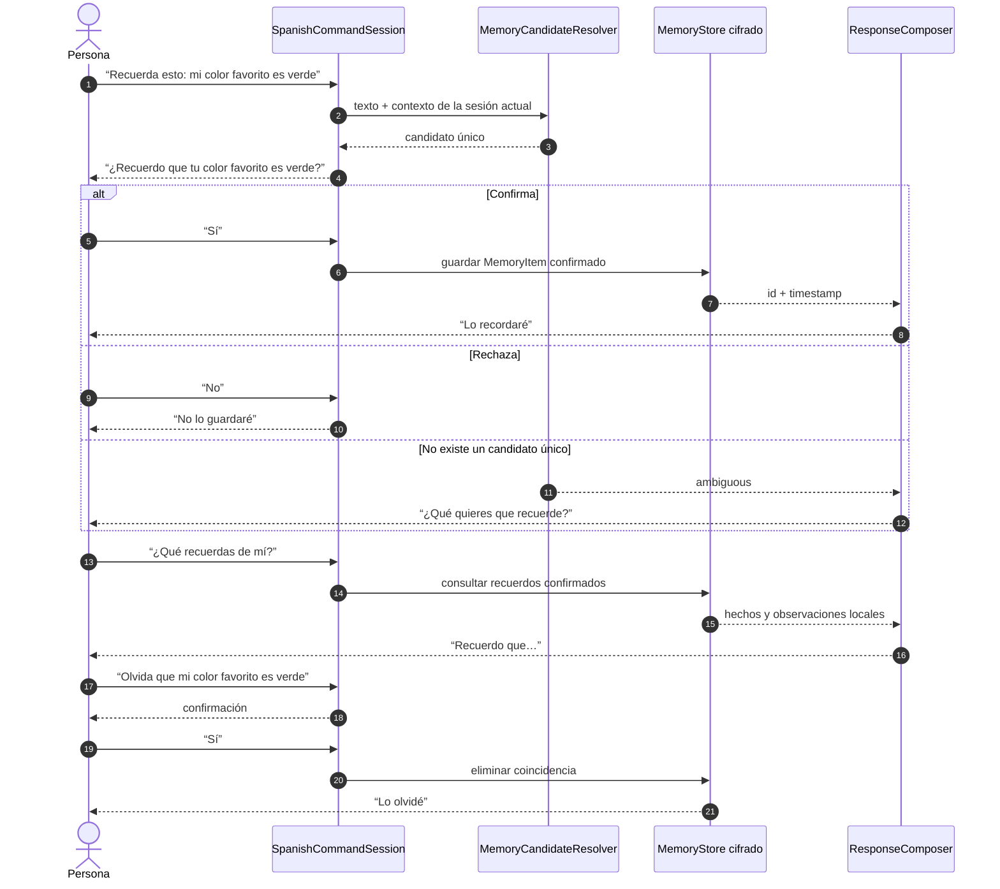
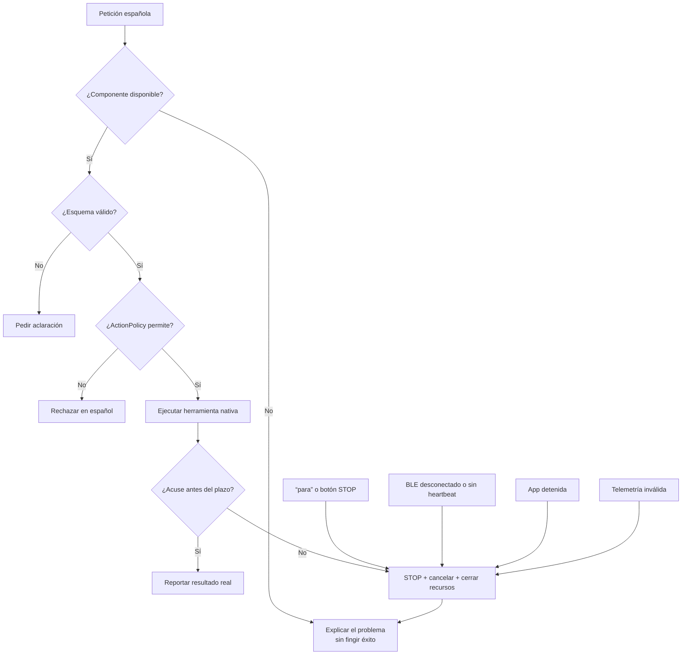

# Runtime flows

These Mermaid diagrams specify how the planned Spanish toy behaviors cross the
architecture boundaries defined in `docs/ARCHITECTURE.md`. The scene flow and the
hardware-free step/dance/stop branch now describe delivered implementations;
physical BLE motion remains a target design.

Each section is marked **Delivered**, **Mixed**, or **Planned**. “Mixed” diagrams
show a shipped branch and its future replacement together. For a nontechnical
walkthrough, start with the [owner guide](USER_GUIDE.md).

## Command lifecycle

**Status: planned shared lifecycle.** Current flows implement their relevant
subsets, but there is no general `SpanishCommandSession` or language-model router.



In the current simulated-body flow, “para,” “detente,” and the stop button issue
`STOP` without model inference. A future shared `EmergencyStopController` owns
this rule across every tool and cancels pending model, camera, and memory work.

## Routing a Spanish command

**Status: planned.** The deterministic parsers exist; `SpanishCommandSession`,
`ActionRouter`, the general `ActionPolicy`, and language-model routing do not.



## “Da tres pasos” and “baila”

**Status: mixed.** The protocol loopback branch is delivered. The grey BLE and
Raspberry Pi branch is planned and cannot move hardware today.

```mermaid
sequenceDiagram
    autonumber
    actor Persona
    participant Parser as Parser español
    participant Policy as ActionPolicy
    participant Loop as LoopbackBodyTransport
    participant Codec as BodyProtocolCodec
    participant Peer as LoopbackBodyPeer
    participant BLE as BodyBleTransport
    participant Body as Raspberry Pi BodyController
    participant Stop as EmergencyStopController

    Loop->>Codec: GET_CAPABILITIES
    Codec->>Peer: JSON v1 (bytes)
    Peer-->>Codec: CAPABILITIES (bytes)
    Codec-->>Loop: maxSteps=6, seal_wiggle, watchdog=750 ms

    Persona->>Parser: “Da tres pasos”
    Parser->>Policy: move_steps(count=3)
    Policy->>Loop: BodyCapabilities negociadas

    alt Cantidad permitida
        Policy->>Loop: MOVE_STEPS(3, commandId, deadline)
        Loop->>Codec: codificar comando tipado
        Codec->>Peer: JSON v1 (bytes)
        Peer-->>Codec: ACCEPTED + duración (bytes)
        Codec-->>Loop: evento validado
        Loop-->>Persona: “Simulación: dando 3 pasos…”
        loop Antes de 750 ms mientras esté activo
            Loop->>Codec: HEARTBEAT con ID único
            Codec->>Peer: JSON v1 (bytes)
            Peer-->>Codec: ALIVE(moving=true)
        end
        Peer-->>Codec: COMPLETED (bytes)
        Codec-->>Loop: evento validado
        Loop-->>Persona: “Simulación completada: di 3 pasos”
    else Fuera de rango
        Policy-->>Persona: aclaración o rechazo en español
    end

    opt La persona dice “para” durante el movimiento
        Persona->>Stop: “para”
        Stop->>Loop: STOP(stopCommandId)
        Loop->>Codec: STOP JSON v1
        Codec->>Peer: bytes
        Peer-->>Loop: STOPPED solicitado
        Loop-->>Persona: “Simulación detenida”
    end

    Persona->>Parser: “Baila”
    Parser->>Policy: dance(routineId="seal_wiggle")
    Policy->>Loop: DANCE(seal_wiggle, commandId, deadline)
    Loop->>Codec: comando/eventos JSON v1
    Codec->>Peer: bytes
    Peer-->>Loop: COMPLETED o STOPPED validado

    rect rgb(245, 245, 245)
        Note over Policy,Body: Futuro transporte físico, no ejecutado hoy
        Policy->>BLE: GET_CAPABILITIES / comando validado
        BLE->>Body: GATT con heartbeat
        Body-->>BLE: ACCEPTED / COMPLETED / STOPPED
    end
```

The shipped branch crosses the strict production v1 codec but is explicitly
simulated and never opens Bluetooth. Malformed or unexpected peer telemetry
disconnects the loop and stops its active command. The app never sends free-form
joint or motor values. In the future physical branch, the Raspberry Pi executes a
bounded two-servo routine and independently stops when its BLE watchdog or
deadline expires.

## “¿Qué sabes de X?”

**Status: planned.** This means open-ended knowledge such as dinosaurs, not the
delivered structured query “¿qué sabes de Pedro?”. No conversational model runs.



The response admits uncertainty and does not present model training knowledge as
current information.

## “¿Qué ves?”

**Status: delivered.** Free-form scene captioning is not; the current result is a
bounded YOLO object report plus the guarded SFace branch described below.



A scene without YOLO's `person` class does not run identity recognition. The
unlocked user may explicitly choose a previously stored cat/dog for a photo;
object detection never guesses an individual pet. Named photos are grouped via a
separate encrypted subject registry. Every capture initially enters app-private
troubleshooting history, where the user can remove a tag, forget one identity,
delete one record and its linked identity, or erase everything. An optional sleep
policy may later delete captures with a conclusive no-object/error outcome that
remain unnamed. Recognized but unnamed objects remain. A clear face match is only
a toy label and never authentication.

## “¿A quién ves?” and face enrollment

**Status: planned as standalone spoken commands.** The delivered “¿qué ves?” flow
can already match a clear enrolled face and can enroll an unknown usable face
after an unlocked on-screen confirmation.



Face matches are friendly labels, never authentication. They cannot authorize
motion, reveal private memories, or enter owner settings.

## Memoria estructurada sobre personas

**Status: delivered.**



The complete bounded declaration is explicit authorization to store that one
fact. Partial hypotheses, unsupported predicates, malformed names, out-of-range
ages, and overlong values never mutate memory. Person memory and face identity
remain separate encrypted registries.

## Memoria estructurada sobre gatos y perros

**Status: delivered.**



Only `gato`, `gata`, `perro`, and `perra` are accepted. Individual pet facts and
queries require the species marker so an unqualified name cannot collide with a
person. The unlocked **Memorias** screen combines both record types but person,
pet, and face data retain separate keys and registries.

## Sueño local y consolidación segura

**Status: delivered.**



The worker never opens microphone/camera, initializes inference, accesses the
network, generates memories, trains weights, deletes distinct facts, or controls
the body. Unnamed-photo deletion is initially disabled and independent of the
automatic schedule; unreadable face/subject registries stop cleanup rather than
classifying every photo as unknown. A one-time request can be cancelled;
disabling automatic sleep cancels only the periodic request.

## “Recuerda esto”

**Status: planned.** Only the bounded person and pet declarations above are
durable spoken-memory commands today.



Ordinary conversation is ephemeral. Only explicit bounded `PersonMemoryRecord`
or `PetMemoryRecord` updates, or separately confirmed future `MemoryItem` records,
enter durable memory, and a remembered scene stores text rather than another copy
of its camera frame.
The separate visual troubleshooting history initially retains the original
`describe_scene` capture until manual deletion or opted-in unrecognized-photo
cleanup; recognized captures remain even without a person/pet name.

## Failure containment

**Status: mixed safety contract.** The loopback implements protocol deadlines,
heartbeat, invalid-telemetry, lifecycle, and stop containment. The same contract
must govern the future BLE transport and physical body.


