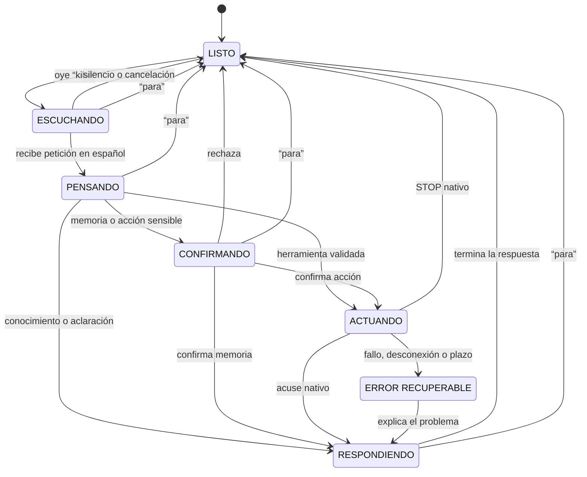
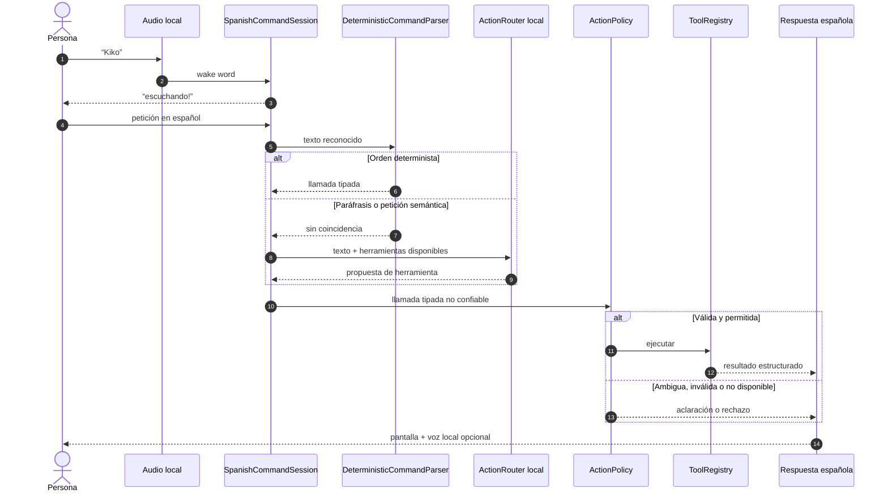
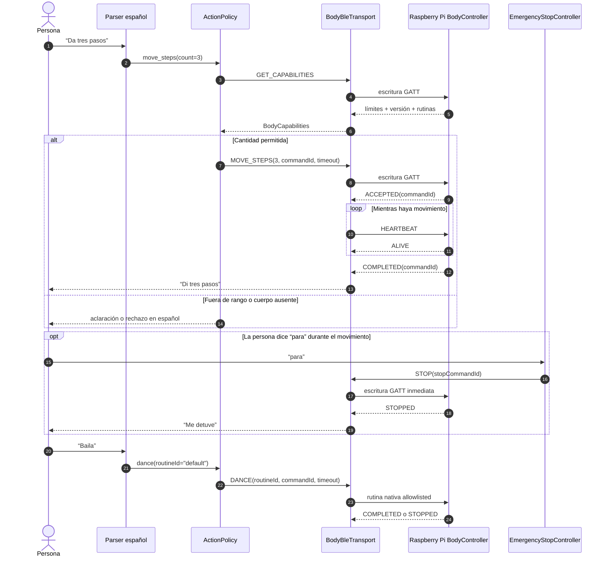
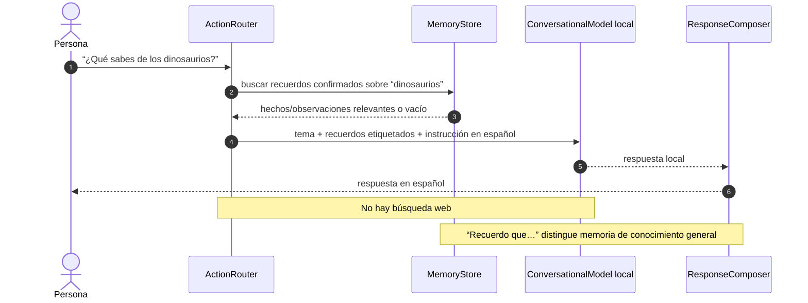
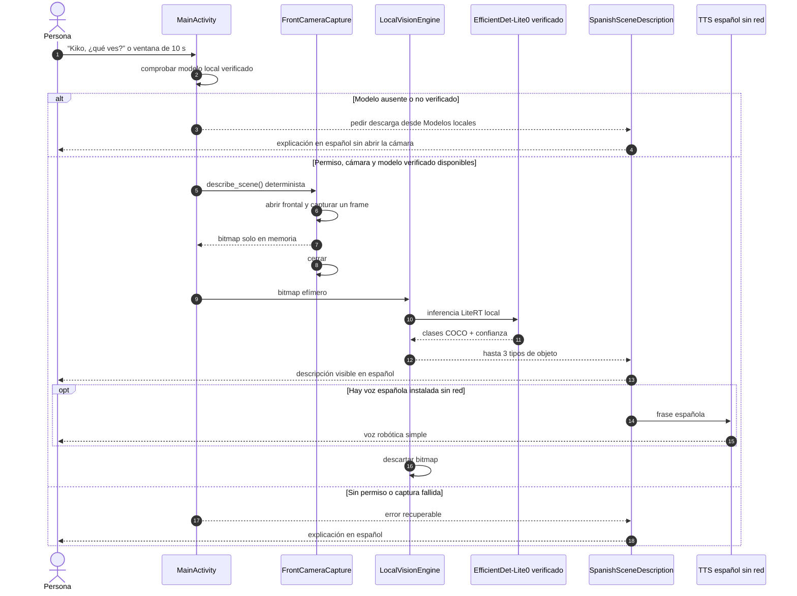
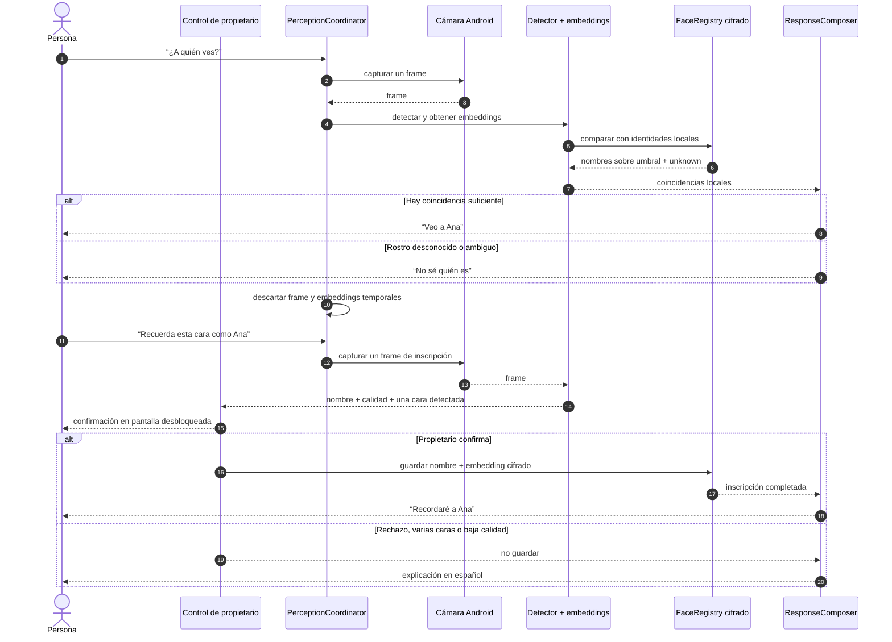
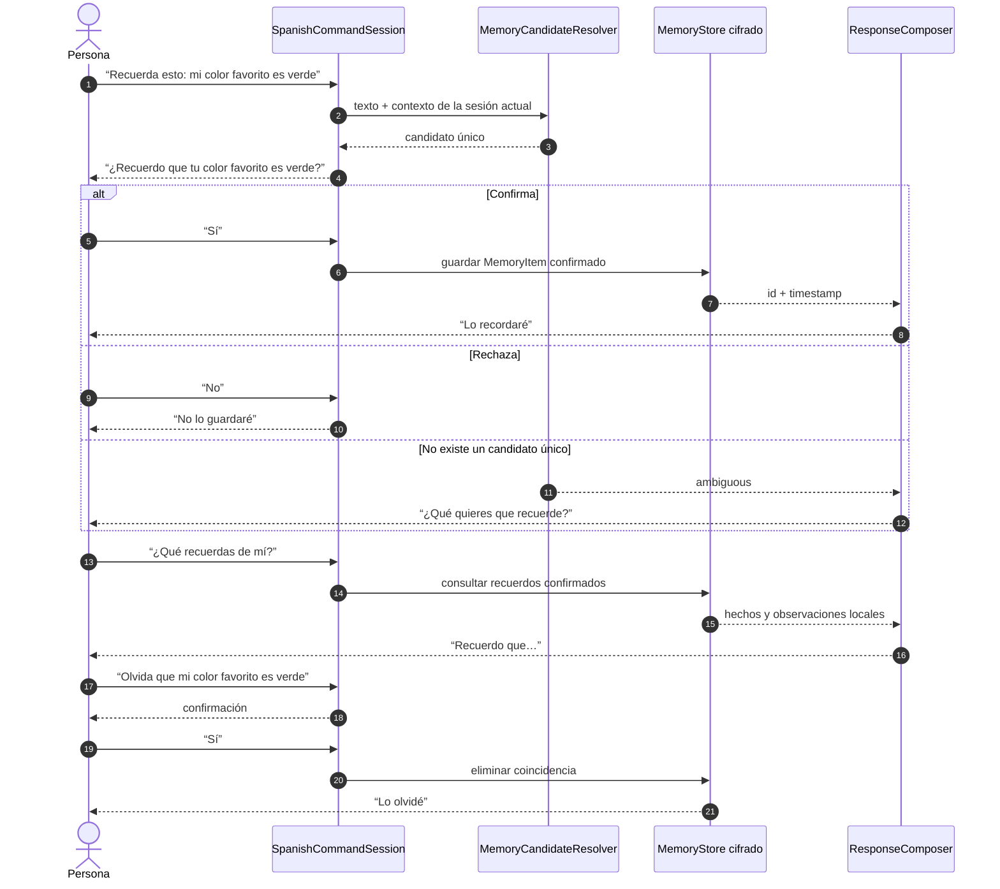
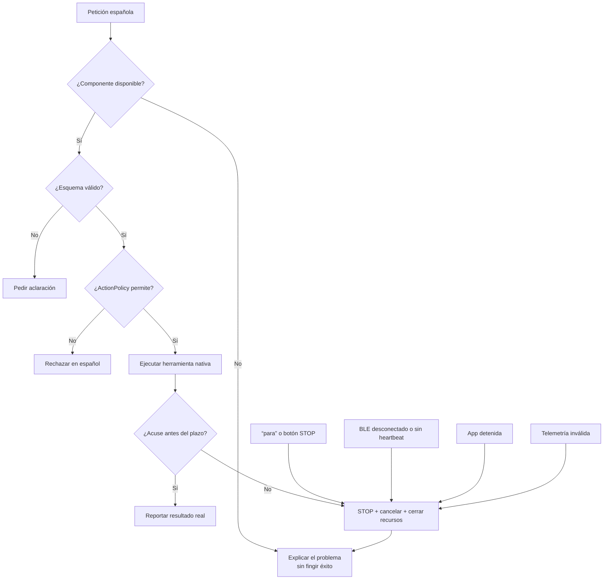

# Runtime flows

These Mermaid diagrams specify how the planned Spanish toy behaviors cross the
architecture boundaries defined in `docs/ARCHITECTURE.md`. Most describe the
target design. The “¿Qué ves?” flow now includes the delivered local
object-detection implementation.

## Command lifecycle

`EmergencyStopController` issues `STOP` on the acting transition without waiting
for model inference. Any transition to `Idle` caused by “para” also cancels
pending model, camera, and memory work.

## Routing a Spanish command

## “Da tres pasos” and “baila”

The app never sends free-form joint or motor values. The Raspberry Pi executes a
bounded two-servo routine and independently stops when its BLE watchdog or
deadline expires.

## “¿Qué sabes de X?”

The response admits uncertainty and does not present model training knowledge as
current information.

## “¿Qué ves?”

A normal scene description does not run identity recognition and does not retain
the frame. EfficientDet-Lite0 is a bounded object detector rather than a scene
captioner; a future richer local model may replace it without changing the
explicit permission, ephemeral capture, or no-network boundaries.

## “¿A quién ves?” and face enrollment

Face matches are friendly labels, never authentication. They cannot authorize
motion, reveal private memories, or enter owner settings.

## “Recuerda esto”

Ordinary conversation is ephemeral. Only confirmed `MemoryItem` records enter
durable storage, and a remembered scene stores text rather than its camera frame.

## Failure containment

