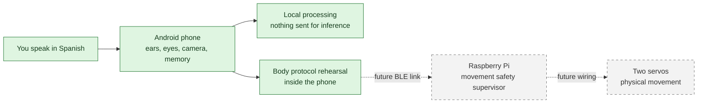
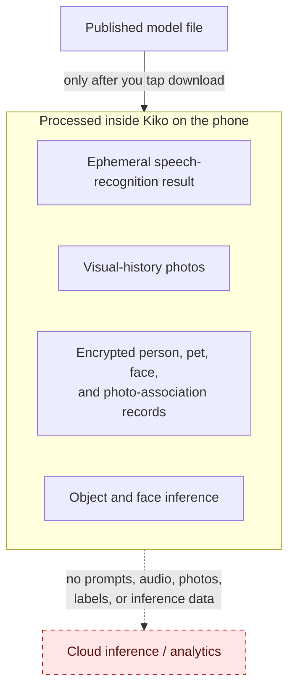

# Kiko owner guide

This guide explains Kiko without assuming Android, artificial intelligence, or
robotics experience. The spoken examples are in Spanish because Kiko is designed
to interact in Spanish.

## Kiko in one minute

Kiko is a personal, noncommercial toy built around an Android phone. Think of the
parts like this:

- the **phone** is Kiko's face, ears, eyes, camera, and private notebook;
- the future **Raspberry Pi** is the body's safety supervisor, like a spinal cord
  that checks every movement;
- the two future **servos** are the muscles;
- the body protocol is a set of numbered, sealed instruction cards. The phone may
  request “take three steps,” but it may never write raw motor instructions.

Today, the phone features listed below work and the body conversation can be
rehearsed inside the app. Bluetooth and physical movement are not connected yet.

Solid green boxes work now. Dashed grey boxes are the next hardware stage.

## What works now

| You want Kiko to… | What to do | What really happens |
| --- | --- | --- |
| Wake up | Say “Kiko” | The eyes open and the screen says **escuchando!** |
| Rehearse walking | Say “Kiko, da tres pasos” | The full body message exchange is simulated; nothing moves |
| Rehearse dancing | Say “Kiko, baila” | Kiko simulates the fixed, allowlisted `seal_wiggle` dance |
| Stop a rehearsal | Say “para” or “detente,” or tap **Detener simulación** | The current simulated action stops |
| Look at the scene | Say “Kiko, ¿qué ves?” | Kiko previews the rear camera, takes one photo, and detects common objects locally |
| Remember a person fact | Say “Kiko, la comida favorita de Pedro es la pasta” | One clearly stated fact is encrypted and saved on the phone |
| Remember a cat or dog | Say “Kiko, Luna es la gata de Pedro” | A separate encrypted pet record is saved |
| Recall a saved fact | Ask “Kiko, ¿qué sabes de Pedro?” | Kiko answers only with fields that were explicitly saved |
| Maintain local records | Open **Sueño** | Android waits for safe conditions, then checks and consolidates local records |

Kiko can download language-model files, but it cannot run them yet. It therefore
cannot hold a general open-ended conversation or answer questions such as “¿qué
sabes de los dinosaurios?”. It also cannot connect to or move a physical body yet.

## Before the first use

Kiko currently needs:

- a physical phone running Android 12 or newer;
- an installed Spanish on-device speech service;
- microphone permission;
- camera permission only when you use **¿qué ves?**; and
- the local **YOLO26n** model for object detection, plus **SFace** if you want
  enrolled-face matching.

Open **Modelos locales** in Kiko to download those two vision files. Downloads
require internet because the files must arrive from their published sources.
After download, Kiko checks each file's SHA-256 fingerprint. That fingerprint is
like checking both the seal and serial number on a package: a file is not used if
it does not exactly match the expected artifact.

The other four catalog entries are optional language-model files. Kiko can safely
download, verify, inspect, cancel, and delete them, but cannot perform language-
model inference with them yet.

## A normal conversation

1. Face the phone screen toward you and make sure the media volume is audible.
2. Say **“Kiko.”** The eyes should open and **escuchando!** should appear.
3. Say one supported command within ten seconds. You can also combine both parts,
   for example **“Kiko, ¿qué ves?”**
4. Read the screen if you do not hear the voice. Kiko speaks only when Android has
   an installed Spanish voice that declares it can work without the network.

The eyes are also a status signal: closed means Kiko is waiting for the wake word,
open and moving means it is listening, and squinting means the vision flow is
working.

## Rehearsing the body safely

The current loopback is like testing both ends of a telephone call in the same
room. The app creates the exact versioned messages intended for the Raspberry Pi,
passes them through its strict encoder and decoder, and waits for accepted and
completed replies. This exercises the conversation rules without using Bluetooth
or applying power to a motor.

Supported examples are:

- “Kiko, da un paso” through “Kiko, da seis pasos”;
- “Kiko, baila”; and
- “para” or “detente” while the simulation is active.

The six-step limit comes from negotiated simulated-body capabilities. Kiko
refuses larger, missing, fractional, or unclear counts. The app displays
**Cuerpo simulado · protocolo v1 en bucle local** so simulated success cannot be
mistaken for physical movement.

When the physical milestone begins, the Android transport will be replaced with
a BLE transport. The Raspberry Pi—not the language model or Android UI—will own
servo calibration, movement limits, the heartbeat watchdog, connection-loss
stopping, and the final physical stop.

## Asking “¿qué ves?”

Kiko shows a live rear-camera preview so you can aim the phone, captures one
still, closes the camera, and processes the image on the device. YOLO26n can name
up to three common COCO object types. This is bounded object detection, not a
human-like description of everything happening in the scene.

Every completed attempt is saved in **Historial visual**, including attempts that
recognize nothing or end in an analysis error. The saved image and Kiko's exact
Spanish result are there for troubleshooting and can be deleted one at a time or
all at once.

If a person is detected, Kiko can compare one usable face against identities that
an unlocked owner explicitly enrolled. A clear match may produce “Veo a Ana.” An
unknown usable face prompts for a short name, but stores it only after the owner
taps **Guardar** on the unlocked phone. Face matching is a friendly toy label,
never proof of identity, authentication, or permission to reveal private memory.

The owner can also associate a saved photo with a cat or dog already listed in
**Memorias**. Kiko never guesses an individual pet from object detection.

## What “memory” means

Kiko's current memory is closer to a small box of labeled index cards than to
human memory. A person card can hold a favorite food, up to 20 likes, and an age.
A cat or dog card can additionally hold its species and owner. There are at most
100 person cards and 100 pet cards.

Kiko saves only supported, complete statements such as:

- “La comida favorita de Pedro es la pasta.”
- “A Pedro le gusta el fútbol.”
- “Pedro tiene 10 años.”
- “Luna es la gata de Pedro.”
- “A la gata Luna le gusta dormir.”
- “La gata Luna tiene 3 años.”

For an individual pet fact or question, say `gato`, `gata`, `perro`, or `perra`.
That species word prevents Kiko from confusing a pet and a person with the same
name. Other animal species are not supported yet.

Open **Memorias** on an unlocked phone to inspect records, delete one record, or
erase them all. Person facts, pet facts, face identities, and photo associations
use separate encrypted registries. Kiko does not turn ordinary conversation into
memory and does not invent missing fields.

## What “Sueño” means

**Sueño** is a careful librarian, not a dreaming or learning brain. When enabled
or requested, Android waits until the phone is charging, idle, not low on battery
or storage, and thermally safe. The librarian then validates encrypted records,
merges only equivalent duplicates, and reports counts.

It never opens the microphone or camera, uses the network, trains a model, invents
a memory, moves the body, or automatically deletes a distinct fact.

**Borrar fotos no reconocidas** is a separate destructive option and starts off.
If enabled, a completed sleep run may permanently delete a photo only when its
result conclusively contains no accepted object or an analysis error and no owner
later named a person or pet on it. Recognized but unnamed objects are retained.

## Privacy at a glance

Kiko declares internet access only for downloads the owner starts. Kiko does not
send prompts, microphone audio, camera images, labels, memory, or inference data
to a cloud service. Android's speech recognizer and text-to-speech engine are
temporary platform components; Kiko requests on-device Spanish recognition and
uses speech output only from a voice Android marks as offline.

Uninstalling Kiko removes its private data and model files. The app does not use
broad storage access and Android backup is disabled.

## If something does not work

| Symptom | Check |
| --- | --- |
| Kiko does not wake | Keep the app in front, verify microphone permission, and check that an on-device Spanish recognizer is installed |
| You cannot hear Kiko | Raise media volume and read the screen; the phone may not have an offline Spanish voice |
| The eyes are hard to see | Turn the display toward you before speaking |
| “¿qué ves?” asks for a model | Open **Modelos locales** and download/verify YOLO26n; download SFace for face matching |
| The wrong camera view is framed | Point the rear camera, not the screen, at the scene while watching the preview |
| A body command says “simulación” | This is expected: Bluetooth and physical movement are not implemented yet |
| A fact is ignored | Use one complete supported sentence; pet facts and questions need the species word |
| A requested Sueño run does not start | Leave the phone charging and idle; Android also waits for healthy battery, storage, and temperature |

For exact accepted phrases, see [Spanish command contract](COMMANDS.md). For the
complete product status and limitations, see [Product definition](PRODUCT.md).

## A safety note for the future body

Do not connect servos directly to the phone or infer wiring from a diagram. The
hardware files intentionally leave board, servo, power, pin, geometry, and
calibration decisions incomplete until the real parts are identified and
measured. Follow [hardware/README.md](../hardware/README.md) before any powered
test. Physical integration must add a repeatable emergency-stop test and must
never use free-form model output as motor commands.
